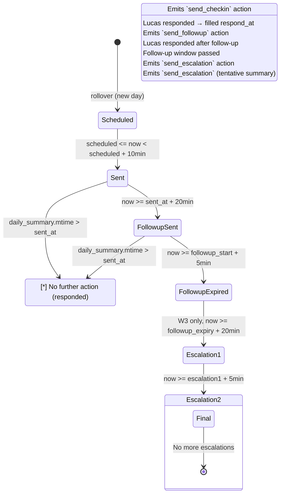
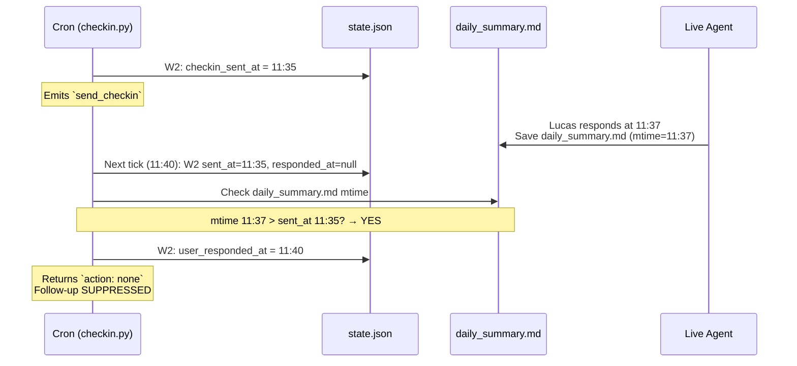
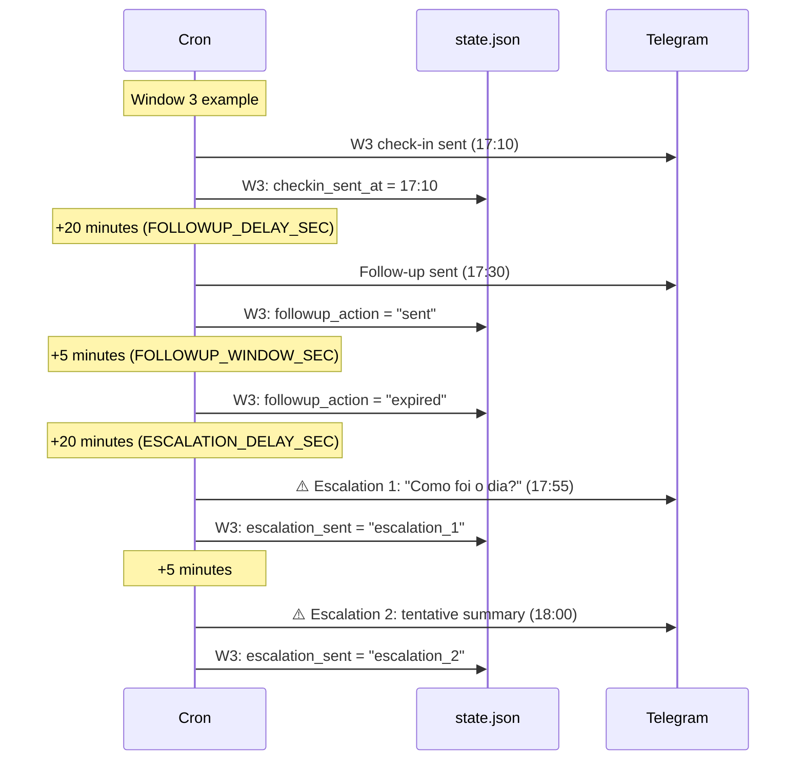
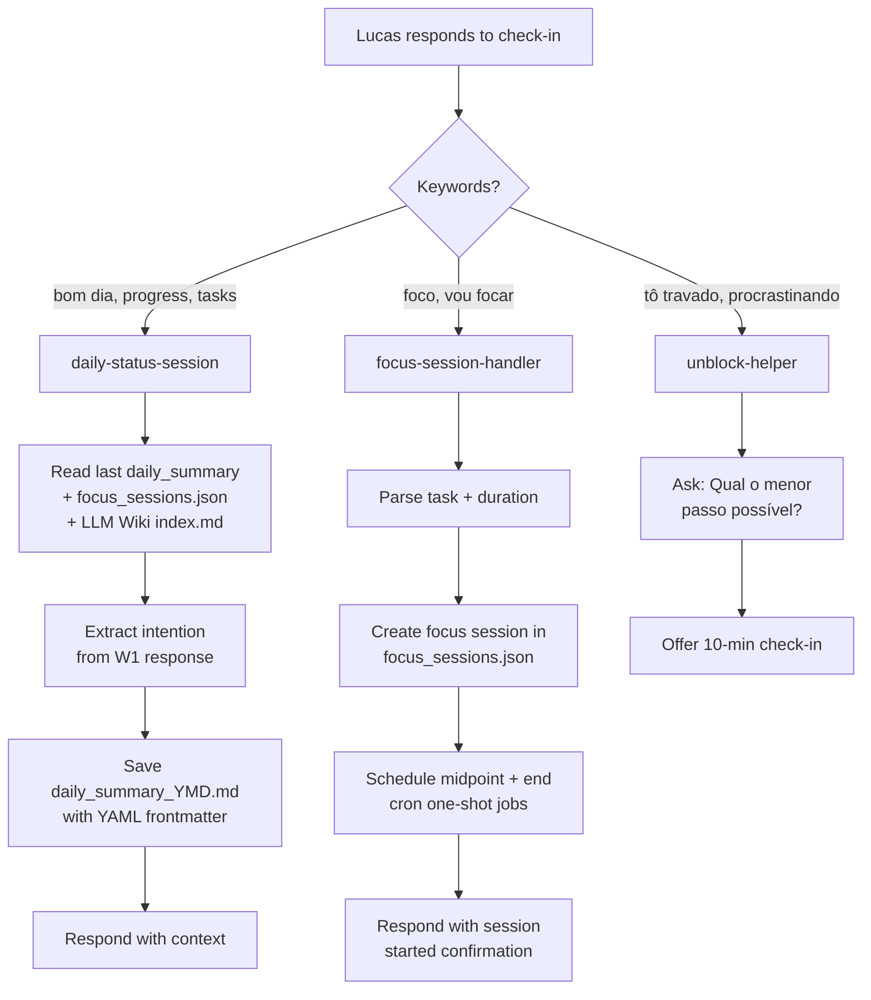
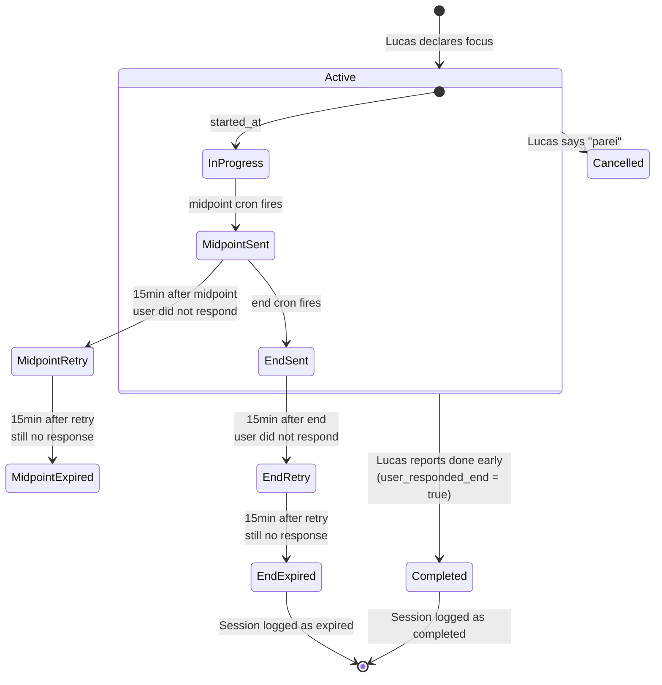
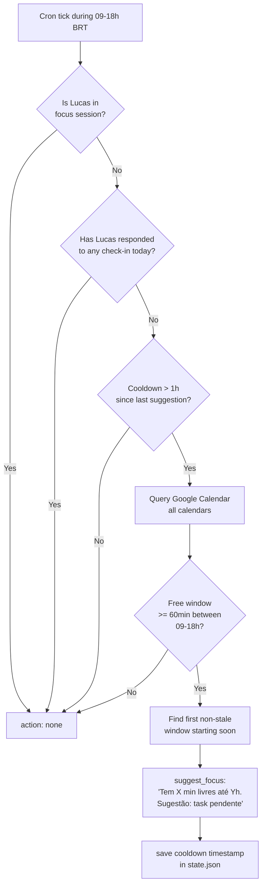
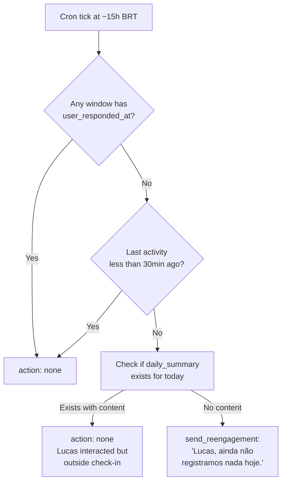
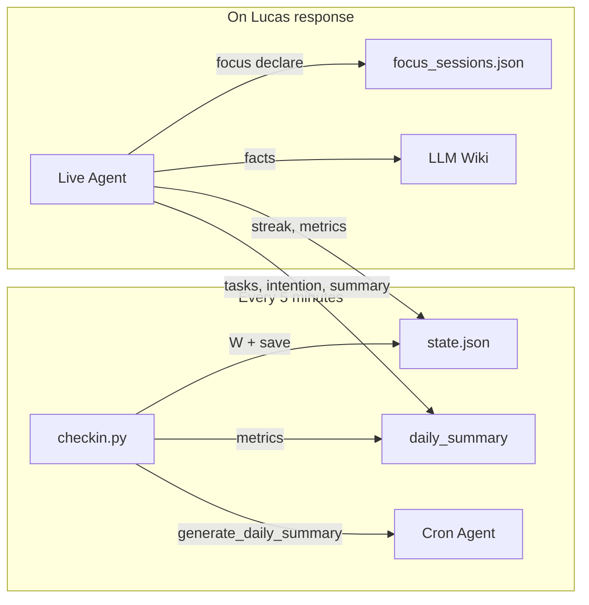
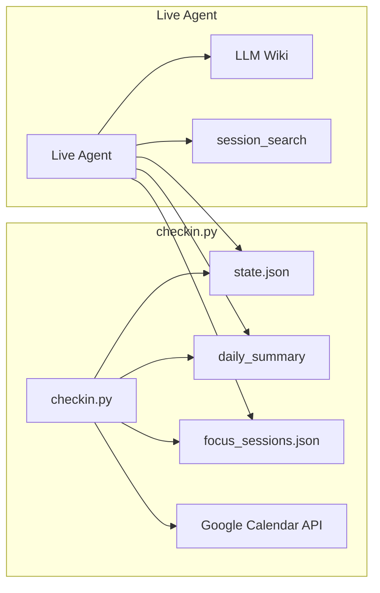

# Accountability Assistant — Flow & Architecture

> Last updated: 2026-07-09 · Version 2.6

This document describes the complete behavior of the Hermes accountability system — the cron-based check-in engine (`checkin.py`), the live agent skills, the state machine per check-in window, follow-up & escalation logic, focus session tracking, and proactive calendar-based suggestions.

---

## 1. Cron Schedule & Check-in Windows

```mermaid
gantt
    title Cron Windows (BRT timezone, Monday–Friday)
    dateFormat  HH:mm
    axisFormat %H:%M

    section Cron active (UTC)
    Cron ticks every 5min :cron, 08:00, 12:00
    Cron ticks every 5min :cron2, 15:00, 18:00

    section Check-in Windows
    W1 Morning    :w1, 09:00, 09:10
    W2 Midday     :w2, 11:30, 11:40
    W3 End of day :w3, 17:00, 17:10

    section Secondary Cron Features
    Proactive Focus (09-18h) :pf, 09:00, 18:00
    Re-engagement (~15h BRT) :re, 15:00, 15:01
    Daily Summary (18:30)    :ds, after w3, 18:30
    Weekly Report (Fri 18:00):wr, after w3, 18:00
```



### Window Timing Constants

| Constant | Value | Meaning |
|---|---|---|
| `CHECKIN_WINDOW_SEC` | 600s (10 min) | How long after `scheduled_epoch` the check-in can be sent |
| `FOLLOWUP_DELAY_SEC` | 1200s (20 min) | Wait time before follow-up fires |
| `FOLLOWUP_WINDOW_SEC` | 300s (5 min) | Window in which follow-up can be sent |
| `ESCALATION_DELAY_SEC` | 1200s (20 min) | Wait after follow-up for escalation |
| `FOCUS_RETRY_WINDOW_SEC` | 900s (15 min) | Retry window for focus session check-ins |
| `PROACTIVE_COOLDOWN_SEC` | 3600s (1h) | Cooldown between proactive focus suggestions |

### Check-in Window Definitions

```python
WINDOWS = {
    1: (9, 0, 9, 30),      # W1: 09:00–09:30 BRT
    2: (11, 30, 12, 0),    # W2: 11:30–12:00 BRT
    3: (17, 0, 17, 45),    # W3: 17:00–17:45 BRT
}
```

Each window has a `scheduled_epoch` randomly picked within this range. The check-in can be sent any time `scheduled <= now < scheduled + CHECKIN_WINDOW_SEC` (10-minute window).

---

## 2. Window State Machine

Each check-in window (W1, W2, W3) goes through a finite state machine. The state is persisted in `state.json`.



### State Fields (per window in `state.json`)

| Field | Type | Description |
|---|---|---|
| `scheduled_epoch` | int | When the check-in is randomly scheduled |
| `checkin_sent_at` | int or null | Epoch when the check-in message was delivered |
| `user_responded_at` | int or null | Epoch when the user was detected as having responded |
| `followup_action` | null / "sent" / "skipped" / "expired" | Follow-up status |
| `followup_sent_at` | int or null | Epoch when follow-up was delivered |
| `escalation_sent` | null / "escalation_1" / "escalation_2" | Escalation stage (W3 only) |
| `marker` | string | Unique response token for tracking |

---

## 3. Auto-fill Mechanism (responded_at detection)

The `user_responded_at` field is filled by `checkin.py` **after the fact** — it infers that Lucas responded by checking if `daily_summary.md` for today was modified AFTER the check-in was sent.



### Anti-pattern (why mtime comparison is needed)

```
Scenario: Lucas responded to W1 at 09:00, but ignored W2
  daily_summary.md mtime = 09:00 (from W1 response)
  
  ❌ Without mtime check: "daily_summary exists → mark W2 as responded"
     → W2 follow-up NEVER fires → Lucas never held accountable for W2
  
  ✅ With mtime check: "mtime 09:00 < W2.sent_at 11:35 → Lucas did NOT respond to W2"
     → Auto-fill skipped → Follow-up fires → Lucas held accountable
```

---

## 4. Follow-up & Escalation Timeline



### Follow-up Window Summary

| Step | Trigger | Action |
|---|---|---|
| Check-in | `scheduled <= now < scheduled + 10min` | `send_checkin` + set `checkin_sent_at` |
| Follow-up | `now >= sent_at + 20min` AND `window < 5min` | `send_followup` + set `followup_action = "sent"` |
| Follow-up expiry | `now >= followup_start + 5min` | Set `followup_action = "expired"` |
| Escalation 1 (W3 only) | `now >= followup_expiry + 20min` | `send_escalation` (polite) |
| Escalation 2 (W3 only) | `now >= escalation1 + 5min` | `send_escalation` (tentative summary) |

---

## 5. Live Agent Interactions

When Lucas responds to a check-in, the **daily-status-session** skill activates.



### What the skill saves in `daily_summary`

```yaml
---
date: '2026-07-09'
summary_text: 'Atuando na otimização de queries do Oracle'
intention: 'Concluir remoção de duplicação de memória nos fetchs'
tasks:
  - name: 'Remover duplicação de memória nos fetchs do oracle'
    status: em andamento
  - name: 'Executar benchmarks comparativos'
    status: pendente
plans_for_next_day: 'Primeira task: analisar resultados do benchmark'
---
```

---

## 6. Focus Sessions



### Focus Session Lifecycle

| Phase | Trigger | Action |
|---|---|---|
| **Declare** | Lucas: "vou focar em X por 2h" | Create entry in `focus_sessions.json` |
| **Midpoint** | Cron job at start + duration/2 | Ask: "Ainda focado? Como está?" |
| **End** | Cron job at start + duration | Ask: "Terminou? Quer marcar como concluído?" |
| **Retry** | No response + 15min | Re-send check-in |
| **Expire** | No response + 30min | Mark session expired, escalate |
| **Complete early** | Lucas: "terminei" | Mark completed, update daily_summary |

---

## 7. Proactive Focus Suggestions



### Re-engagement (~15h BRT)



---

## 8. Data Architecture

### Files and their roles

| File | Path | Writer | Reader | Contents |
|---|---|---|---|---|
| `state.json` | `{BASE_DIR}/state.json` | `checkin.py` | `checkin.py`, cron agent, live agent | Check-in window states, cooldowns, weekly report flags |
| `daily_summary_YYYY-MM-DD.md` | `{BASE_DIR}/daily_summary_*.md` | `checkin.py`, live agent | `checkin.py`, live agent | YAML frontmatter + Markdown: tasks, intentions, plans, metrics |
| `focus_sessions.json` | `{BASE_DIR}/focus_sessions.json` | live agent, `checkin.py` | `checkin.py`, live agent | Active/completed sessions, stats, streaks |
| `jobs.json` | `{BASE_DIR}/../cron/jobs.json` | deploy.sh | Hermes cron scheduler | Cron job definitions + agent prompts |
| `SKILL.md` | Skills directory | deploy.sh | Live agent | Behavior instructions for agent |
| `SOUL.md` | Profile root | deploy.sh | Live agent | Agent personality + guardrails |
| `config.yaml` | Profile root | Admin | Hermes gateway | Model, plugins, platform configs |
| `LLM Wiki` | `{WIKI_PATH}/` | Live agent | Live agent | Durable facts (user profile, projects) |

### Write flow



### Read flow



---

## 9. Complete Day Timeline


---

## 10. Key Design Decisions

| Decision | Why |
|---|---|
| **Randomized check-in times** | Prevents pattern predictability; feels more natural |
| **Daily summary as response proof** | No need for explicit "I responded" API call; file mtime is the evidence |
| **mtime > sent_at for auto-fill** | Prevents false positives from earlier-day interactions |
| **followup_action = "sent"** | Prevents duplicate follow-ups in 5-min cron window |
| **Multi-calendar support** | `GOOGLE_CALENDAR_ID=email1,email2` — queries all for free windows |
| **Stale windows >30min are skipped** | Prevent suggesting focus in windows that already started long ago |
| **Re-engagement only if NO responded** | Only nudge when truly no interaction today |
| **Escalation W3-only** | Morning and midday windows end with follow-up; only end-of-day escalates |
| **Streak from responded check-ins** | `checkins_responded` in `calculate_metrics()` determines streak |
| **Cron runs even during focus** | `is_in_focus_session()` check skips check-in, not cron — focus retries still fire |

---

## 11. Environment Variables

| Variable | Used by | Default |
|---|---|---|
| `CHECKIN_DATA_DIR` | checkin.py | `~/.cron/responsibility_partner` |
| `GOOGLE_SERVICE_ACCOUNT_PATH` | checkin.py | `/opt/data/google-service-account.json` |
| `GOOGLE_CALENDAR_ID` | checkin.py | Comma-separated list of calendar IDs |
| `GEMINI_API_KEY` | (removed — was gemini_meet) | — |
| `PULSE_RUNTIME_PATH` | (removed — was gemini_meet) | — |

---

## 12. Files Modified by This System

| File | Description |
|---|---|
| `hermes-data/scripts/checkin.py` | Main cron script (~1120 lines) |
| `hermes-data/cron/jobs.json` | Cron job definitions + agent prompts |
| `hermes-data/skills/productivity/daily-status-session/SKILL.md` | Live agent skill |
| `hermes-data/skills/productivity/focus-session-handler/SKILL.md` | Focus session skill |
| `hermes-data/skills/productivity/unblock-helper/SKILL.md` | Unblock / task initiation skill |
| `hermes-data/SOUL.md` | Agent personality (accountability tone, rules) |
| `deploy.sh` | Deployment script |
| `docker-compose.yaml` | Container orchestration |
| `.env.example` | Environment template |

