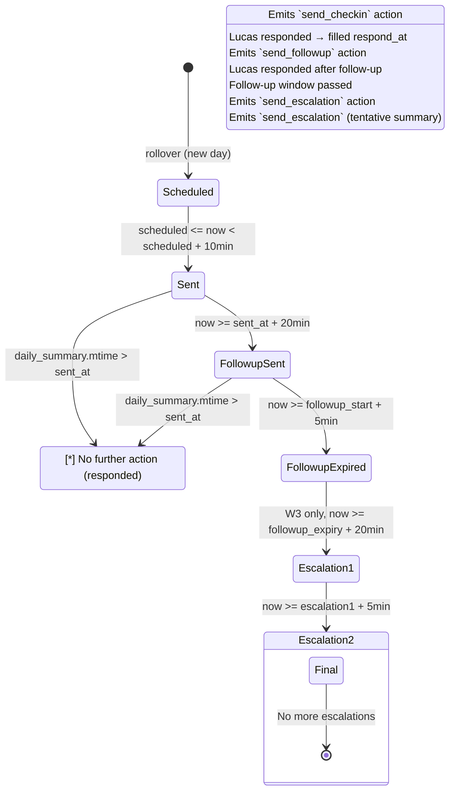
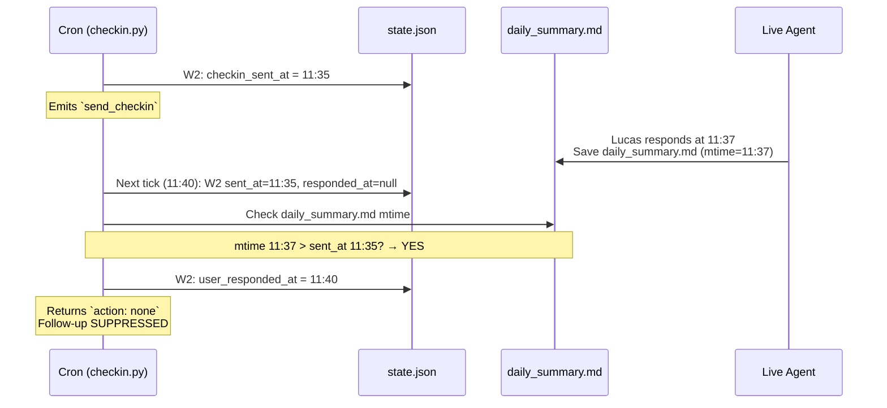
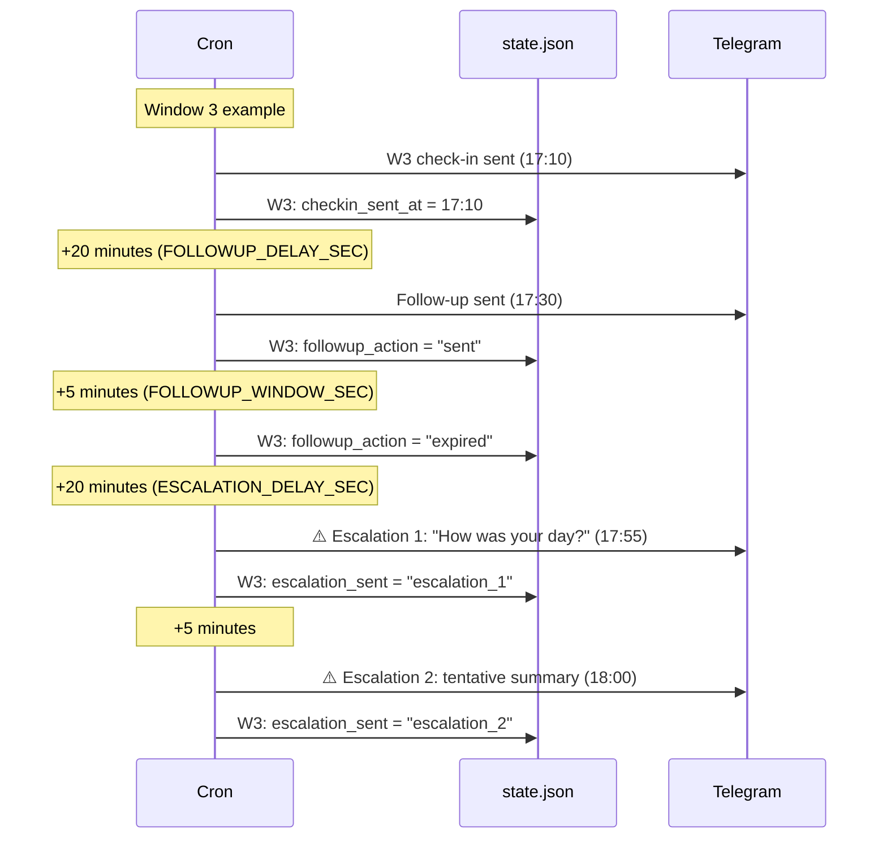
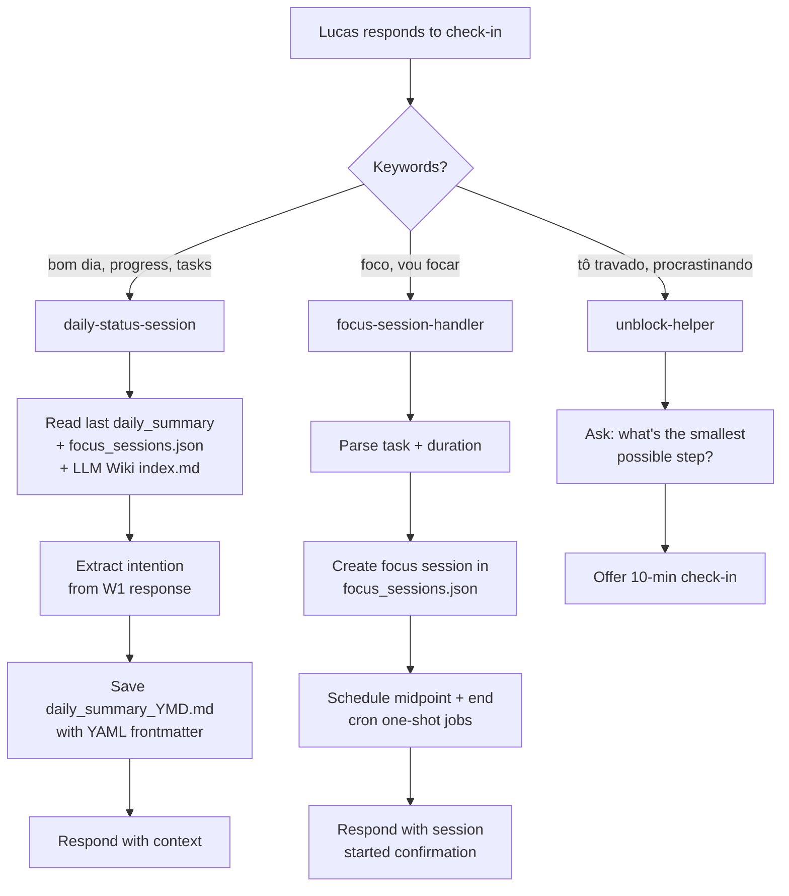
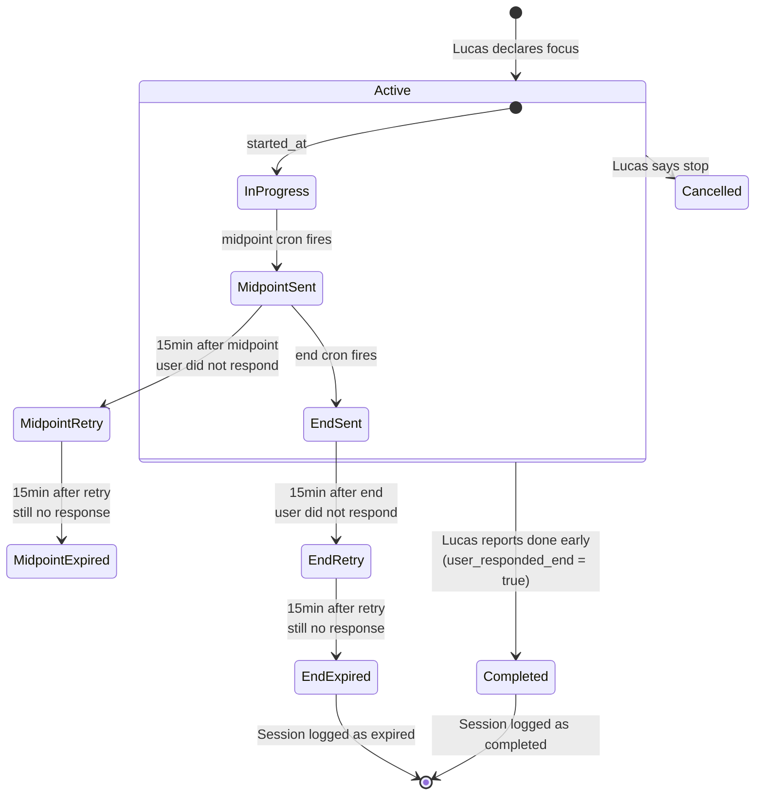
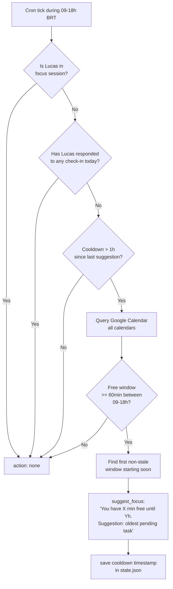
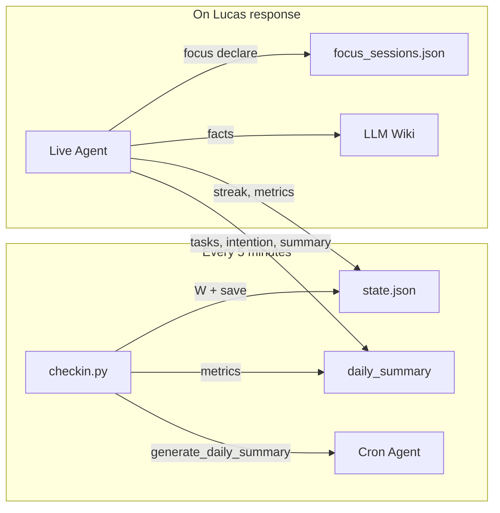
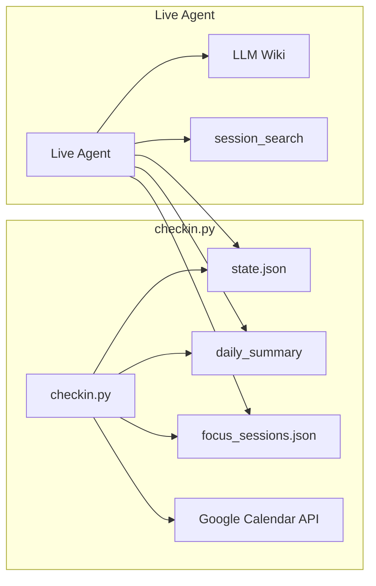

```mermaid
gantt
    title Cron Windows (BRT timezone, Monday–Friday)
    dateFormat  HH:mm
    axisFormat %H:%M

    section Cron active (UTC)
    Cron ticks every 5min :cron, 08:00, 12:00
    Cron ticks every 5min :cron2, 15:00, 18:00

    section Check-in Windows
    W1 Morning    :w1, 09:00, 09:10
    W2 Midday     :w2, 11:30, 11:40
    W3 End of day :w3, 17:00, 17:10

    section Secondary Cron Features
    Proactive Focus (09-18h) :pf, 09:00, 18:00
    Re-engagement (~15h BRT) :re, 15:00, 15:01
    Daily Summary (18:30)    :ds, after w3, 18:30
    Weekly Report (Fri 18:00):wr, after w3, 18:00
```

# Accountability Assistant — Flow & Architecture

> Last updated: 2026-07-09 · Version 2.6

---

## How to Read This Document

Each section has a Mermaid diagram (the visual map) and a short text (the guide). The diagrams show the exact flow, the text explains **why** it works that way. If the diagram is enough for you, skip the text. If something is unclear, the text explains the intent.

**Terms** used throughout: see the [Glossary](#18-glossary) at the end.

---

## 1. Why This Exists

Accountability with ADHD is hard for three reasons: task initiation costs a lot, staying focused needs external scaffolding, and resuming after an interruption is almost a reset. Traditional tools (Pomodoro, static lists) don't work because they break flow when you're deep in concentration and don't help when you're stuck.

Hermes solves this with **scheduled but not predictable check-ins**. Instead of a 9 AM alarm every day (which you ignore after week one), it picks a random time within a window. You know it'll arrive around 9 AM, but not exactly when — this keeps each check-in feeling fresh rather than routine.

The system has three layers:
- **Cron** (checkin.py): sends check-ins, follow-ups, focus suggestions
- **Live Agent** (skills): processes your responses, saves context, manages focus
- **Persistent data** (state.json, daily_summary, LLM Wiki): memory across sessions

---

## 2. System Overview

The system has two agents that don't communicate directly — they share files.

```
┌──────────────────────┐       ┌──────────────────────┐
│   Cron (checkin.py)  │       │   Live Agent (skills) │
│                       │       │                       │
│ Runs every 5 min      │       │ Triggers when you     │
│ Outputs JSON only     │       │ talk to Hermes        │
│ Stateless             │       │ Has tool access       │
└──────┬───────────────┘       └──────┬───────────────┘
       │                              │
       │     ┌────────────────┐       │
       └─────┤  Shared files  ├───────┘
             │  state.json     │
             │  daily_summary  │
             │  focus_sessions │
             │  LLM Wiki       │
             └────────────────┘
```

**Cron Agent**: runs checkin.py, reads the JSON output (`{action, message}`), and delivers (or suppresses) on Telegram according to the rules in `jobs.json`. It's a dumb router — no decisions, just following the script.

**Live Agent**: the Hermes you talk to. Loads skills, reads the wiki, saves daily_summary. It's the one that understands "I finished the task" and updates context.

**Why two separate agents?** The cron needs to be predictable and stateless (same behavior every time), while the live agent needs to be contextual and flexible. Mixing them would make the system fragile.

---

## 3. Cron Schedule & Check-in Windows

The cron runs **every 5 minutes** during two blocks: 08:00-12:00 and 15:00-18:00 BRT, Monday through Friday. Outside those hours, the system does nothing.



### Three windows, three purposes

| Window | Time | What it asks |
|---|---|---|
| **W1** | ~09:00-09:30 | Good morning, what's the most important thing today? Anything bureaucratic to clear early? |
| **W2** | ~11:30-12:00 | How's it going? References what you declared as your day's intention in W1. |
| **W3** | ~17:00-17:45 | How was the day? What's your first task tomorrow? |

Each check-in is sent at a **random** time within its window. This prevents habituation — if it were always 09:15, you'd stop paying attention after a few days. Unpredictability keeps it relevant.

The send window lasts 10 minutes (`CHECKIN_WINDOW_SEC`). If the cron misses that window (e.g. container restarting), that window's check-in is lost until the next one.

### Timing Constants

| Constant | Value | Meaning |
|---|---|---|
| `CHECKIN_WINDOW_SEC` | 600s (10 min) | Window to send the check-in |
| `FOLLOWUP_DELAY_SEC` | 1200s (20 min) | Wait before follow-up |
| `FOLLOWUP_WINDOW_SEC` | 300s (5 min) | Follow-up window |
| `ESCALATION_DELAY_SEC` | 1200s (20 min) | Wait between follow-up and escalation |
| `FOCUS_RETRY_WINDOW_SEC` | 900s (15 min) | Retry for focus session check-ins |
| `PROACTIVE_COOLDOWN_SEC` | 3600s (1h) | Cooldown between focus suggestions |

---

## 4. Window State Machine

Each window (W1, W2, W3) goes through a state machine. The current state is stored in `state.json`.



### How to read the diagram

- **Scheduled → Sent**: the cron picks a random time within the window and sends the check-in. Once sent, `checkin_sent_at` is filled.
- **Sent → AutoFilled**: if today's daily_summary was modified **after** the send, it means you responded. The system fills `user_responded_at` and stops.
- **Sent → FollowupSent**: if 20 minutes pass with no response, the follow-up fires.
- **FollowupSent → AutoFilled**: even after the follow-up, if you respond, the system detects it and stops.
- **FollowupExpired → Escalation**: W3 only. If you didn't respond all day, the system escalates with two progressively firmer messages.

### state.json fields (per window)

| Field | Type | Description |
|---|---|---|
| `scheduled_epoch` | int | Random check-in time |
| `checkin_sent_at` | int or null | When the check-in was delivered |
| `user_responded_at` | int or null | When the system detected your response |
| `followup_action` | null / "sent" / "skipped" / "expired" | Follow-up status |
| `followup_sent_at` | int or null | When the follow-up was delivered |
| `escalation_sent` | null / "escalation_1" / "escalation_2" | Escalation stage (W3 only) |
| `marker` | string | Unique tracking token |

---

## 5. How Responses Are Detected

The system does **not** receive an explicit "Lucas responded" notification. Instead, it infers your response from `daily_summary.md` — the file the live agent saves when you interact.



### Why use the file as proof?

The checkin.py and live agent **don't communicate directly**. They share files. When you respond to a check-in on Telegram, the live agent saves `daily_summary_2026-07-09.md` with YAML frontmatter containing tasks, intentions, etc. On the next cron tick, checkin.py reads that file and detects: "the daily_summary was modified after I sent the check-in → Lucas responded".

### The mtime guard

The critical comparison is `daily_summary.mtime > sent_at`. This exists to prevent a dangerous false positive:

```
Scenario: you responded to W1 (09:00) but ignored W2.
  daily_summary.md mtime = 09:00 (from W1 response)
  
  ❌ Without guard: "daily_summary exists → mark W2 as responded"
     → W2 follow-up NEVER fires → you're never held accountable for W2
  
  ✅ With guard: mtime 09:00 < W2.sent_at 11:35 → did NOT respond
     → auto-fill skipped → follow-up sent → you're held accountable
```

### History: the bug that existed

Before 2026-07-09, `user_responded_at` was **never** auto-filled. The field existed in `state.json` but was read-only — nothing ever wrote to it. Result: even after you responded to W2, the follow-up would fire 20 minutes later. The fix (this section) resolved that.

---

## 6. Follow-up & Escalation

If you don't respond to a check-in, the system escalates progressively. W3 is more aggressive than W1 and W2 because it's the end-of-day wrap-up.



### Why follow-ups exist

With ADHD, it's easy to see a notification, think "I'll reply in a second," and forget entirely. The follow-up exists as a **safety net** — not an aggressive push, just a reminder that you haven't responded. If you already responded, the auto-fill (section 5) suppresses the follow-up.

### Steps

| Step | When | Action | W3 only? |
|---|---|---|---|
| Check-in | Scheduled time | Check-in message | No |
| Follow-up | +20 min without response | "How's it going?" | No |
| Escalation 1 | +20 min after follow-up expires | "How was your day?" | Yes |
| Escalation 2 | +5 min after escalation 1 | Tentative daily summary | Yes |

### Duplicate prevention

The follow-up lasts 5 minutes (`FOLLOWUP_WINDOW_SEC`) and the cron runs every 5 minutes — without protection, the follow-up could fire 1-3 times. The 2026-07-09 fix saves `followup_action = "sent"` alongside `followup_sent_at` **at send time**, blocking re-sends.

---

## 7. Live Agent Interactions

When you respond to Hermes on Telegram, the live agent picks which skill to use based on what you say.



### daily-status-session

The main accountability skill. Triggers when you report progress, respond to check-ins, or say "good morning." In one round it:

1. Reads the last `daily_summary` (up to 7 days back), active `focus_sessions.json`, and the LLM Wiki
2. Extracts the day's intention if responding to W1
3. Saves `daily_summary_YYYY-MM-DD.md` with YAML frontmatter (tasks, intention, status)
4. Responds with context

### focus-session-handler

Triggers when you declare focus ("I'll focus on X for 2h"). It:
- Creates an entry in `focus_sessions.json`
- Schedules two one-shot cron jobs: midpoint (halfway) and end
- Confirms the session started

### unblock-helper

Triggers when you're stuck ("I can't get started," "I'm procrastinating"). Unlike other skills, it does **not** manage tasks — it only asks one question: "What's the smallest possible step?" The idea is to lower the barrier to entry, not decompose the entire task. Offers an optional 10-minute check-in.

### Example daily_summary

```yaml
---
date: '2026-07-09'
summary_text: 'Working on Oracle query optimization'
intention: 'Finish removing memory duplication in Oracle fetches'
tasks:
  - name: 'Remove memory duplication in Oracle fetches'
    status: in progress
  - name: 'Run comparative benchmarks'
    status: pending
plans_for_next_day: 'First task: analyze benchmark results'
---
```

---

## 8. Focus Sessions

When you declare focus, the system creates intermediate check-ins to verify you're still on task.



### Lifecycle

| Phase | Trigger | Action |
|---|---|---|
| **Declare** | "I'll focus on X for 2h" | Create entry in `focus_sessions.json` + schedule cron jobs |
| **Midpoint** | Cron job at halfway | "Still focused? How's it going?" |
| **End** | Cron job at end | "Done? Want to mark as completed?" |
| **Retry** | No response for 15 min | Re-send check-in |
| **Expire** | No response for 30 min | Mark as expired, escalate |
| **Complete early** | "done," "finished" | Mark completed, update daily_summary |

The retry logic exists because during deep focus, you might not see the midpoint notification. The system waits 15 minutes and tries again before assuming you abandoned the session.

---

## 9. Proactive Focus Suggestions

Between 09:00 and 18:00, the system consults your Google Calendar and suggests focus blocks when it detects free windows ≥60 minutes.



### How it works in practice

1. **Queries Google Calendar** via service account. Reads **all** calendars listed in `GOOGLE_CALENDAR_ID` (comma-separated).
2. **Finds free blocks** ≥60 min between 09:00-18:00 BRT.
3. **Filters invalid windows**: already ended, started >30 min ago, or starting >15 min from now.
4. **Suggests the first valid window** with the oldest pending task from daily_summary.
5. **Waits 1 hour** (`PROACTIVE_COOLDOWN_SEC`) before suggesting again.

### Suppression rules

The suggestion is **not** sent if:
- You're in an active focus session
- You've already responded to any check-in today (means you're engaged)
- A suggestion was sent less than 1 hour ago

---

## 10. Re-engagement

Around 15:00 BRT, if no check-in has been responded to all day, the system sends a light nudge.


It's a mid-afternoon tap on the shoulder, not a demand. If you interacted with Hermes earlier (even outside a formal check-in), the re-engagement won't fire — the daily_summary serves as evidence.

---

## 11. Data Architecture

### Files and their roles

| File | Path | Written by | Read by |
|---|---|---|---|
| `state.json` | `{BASE_DIR}/state.json` | `checkin.py` | `checkin.py`, cron agent, live agent |
| `daily_summary_YYYY-MM-DD.md` | `{BASE_DIR}/` | live agent, `checkin.py` | `checkin.py`, live agent |
| `focus_sessions.json` | `{BASE_DIR}/` | live agent, `checkin.py` | `checkin.py`, live agent |
| `jobs.json` | `{BASE_DIR}/../cron/` | deploy.sh | Hermes cron scheduler |
| `SKILL.md` | Skills directory | deploy.sh | Live agent |
| `SOUL.md` | Profile root | deploy.sh | Live agent |
| `config.yaml` | Profile root | Admin | Hermes gateway |
| LLM Wiki | `{WIKI_PATH}/` | Live agent | Live agent |

### Write flow



### Read flow



---

## 12. LLM Wiki

The LLM Wiki (`~/wiki/`) is the **durable facts** memory — things that don't change often and that the agent needs to know across sessions. It's different from daily_summary, which is temporal and disposable.

### What lives in the Wiki

| Page | Content |
|---|---|
| `entities/lucas.md` | User profile: name, preferences, communication style, challenges |
| `concepts/preferences.md` | Interaction preferences (tone, frequency, constraints) |
| `concepts/environment.md` | Technical setup, timezone, tools |
| `concepts/projects.md` | Active projects and their context |
| `SCHEMA.md` | Wiki structure (how to organize pages) |
| `index.md` | Navigation index |

### How the agent uses it

At the start of every conversation, the live agent reads `SCHEMA.md`, `index.md`, and `entities/lucas.md`. This ensures it "remembers" who you are and how you prefer to communicate, even after a session reset.

The agent also **writes** to the wiki when it learns something new and durable — for example, a new project or a preference change. But it never writes **tasks** to the wiki; tasks go in daily_summary.

---

## 13. Complete Day Timeline

Example day with all interactions:

```mermaid
gantt
    title Example Day with Full Interaction
    dateFormat HH:mm
    axisFormat %H:%M

    section Cron System
    W1 check-in        :w1, 09:05, 09:06
    Proactive Focus    :pf1, 09:15, 1min
    W2 check-in        :w2, 11:35, 11:36
    Re-engagement skip :re1, after pf1, 15:00
    Proactive Focus    :pf2, 15:10, 1min
    W3 check-in        :w3, 17:10, 17:11
    Daily Summary gen  :ds1, 18:30, 1min

    section Lucas
    Good morning (W1)  :r1, 09:10, 2min
    Declares focus     :f1, 09:15, 2min
    Midpoint response  :fm1, 10:15, 1min
    W2 response        :r2, 11:37, 2min
    Ends focus         :f2, 11:50, 1min
    W3 response        :r3, 17:15, 2min

    section Focus Session
    Active: 09:15-11:50 :fs, 09:15, 11:50
    Midpoint cron       :fm2, 10:15, 1min
    End cron            :fe1, 11:15, 1min
```



---

## 14. Key Design Decisions

| Decision | Reason |
|---|---|
| **Randomized check-in times** | Prevents habituation. If check-in were always 09:15, you'd tune it out after 3 days. Unpredictability maintains relevance. |
| **Daily summary as response proof** | `checkin.py` and the live agent don't communicate directly. The file on disk is the contract between them. Simpler than an event system. |
| **mtime > sent_at** | Prevents a W1 response from being interpreted as a W2 response. Each check-in validates its own time window. |
| **followup_action = "sent"** | Without this, the follow-up could fire multiple times in the same 5-minute window. Saving state at send time blocks duplicates. |
| **Multiple calendars** | `GOOGLE_CALENDAR_ID=email1,email2` — you have events in more than one calendar. The system queries all of them. |
| **Stale windows >30min skipped** | If the container restarted at 3 PM and the cron comes back, it shouldn't suggest focus on a window that started at 9 AM and already passed. |
| **Re-engagement only with zero interactions** | If you've already talked to Hermes today (even outside a check-in), you don't need a nudge. |
| **Escalation W3-only** | Morning and midday are directional check-ins. Only end-of-day justifies a firmer approach. |
| **Streak from responded check-ins** | Simple gamification: `checkins_responded / checkins_total`. A day with zero responses breaks the streak. |
| **Cron keeps running during focus** | Even during focus, the cron ticks. Regular check-ins are suppressed (`is_in_focus_session()`), but focus retries still work. |

---

## 15. Environment Variables

| Variable | Used by | Default |
|---|---|---|
| `CHECKIN_DATA_DIR` | checkin.py | `~/.cron/responsibility_partner` |
| `GOOGLE_SERVICE_ACCOUNT_PATH` | checkin.py | `/opt/data/google-service-account.json` |
| `GOOGLE_CALENDAR_ID` | checkin.py | Comma-separated list |

> Removed variables: `GEMINI_API_KEY`, `PULSE_RUNTIME_PATH` (were for gemini_meet — discontinued plugin).

---

## 16. Files Modified by This System

| File | Description |
|---|---|
| `hermes-data/scripts/checkin.py` | Main cron script (~1130 lines) |
| `hermes-data/cron/jobs.json` | Cron job definitions + agent prompts |
| `hermes-data/SOUL.md` | Agent personality (accountability tone, rules) |
| `hermes-data/skills/productivity/daily-status-session/SKILL.md` | Status processing skill |
| `hermes-data/skills/productivity/focus-session-handler/SKILL.md` | Focus session skill |
| `hermes-data/skills/productivity/unblock-helper/SKILL.md` | Unblock / task initiation skill |
| `deploy.sh` | Deployment script |
| `docker-compose.yaml` | Container orchestration |
| `.env.example` | Environment template |

---

## 17. Troubleshooting

### Check-in didn't arrive at the expected time

**Symptom:** it's past 09:30 and W1 hasn't arrived.

**Diagnosis:** check `state.json`:
```
docker exec hermes cat /opt/data/profiles/accountability/.cron/responsibility_partner/state.json
```
If `scheduled_epoch` is `null`, the day rollover failed.

**Solution:** force rollover by setting the date to yesterday:
```bash
docker exec hermes python3 -c "
import json
with open('/opt/data/.../state.json') as f: s = json.load(f)
s['date'] = '2026-07-08'
with open('/opt/data/.../state.json','w') as f: json.dump(s,f)
"
```
On the next cron tick (<5 min) the system recreates the windows with the correct date.

---

### Follow-up fired even after responding

**Symptom:** you responded to W2 but got a follow-up 20 minutes later.

**Diagnosis:** the auto-fill (section 5) may not have been deployed. Check if checkin.py has the auto-fill block:
```
docker exec hermes grep "Auto-fill user_responded" /opt/data/profiles/accountability/scripts/checkin.py
```

**Solution:** re-deploy with `./deploy.sh`.

---

### Focus session stuck (status "active" but past end time)

**Symptom:** `focus_sessions.json` shows session as "active" but end_epoch has passed.

**Diagnosis:** the one-shot cron job may have failed (container restarted, job expired).

**Solution:** manually close the session:
```bash
docker exec hermes python3 -c "
import json
with open('/opt/data/.../focus_sessions.json') as f: d = json.load(f)
for s in d.get('active_sessions',[]):
    s['status'] = 'expired'
with open('/opt/data/.../focus_sessions.json','w') as f: json.dump(d,f)
"
```

---

### Focus suggestion ignores calendar events

**Symptom:** focus suggestion appears during a time you have an event.

**Diagnosis:** check whether the service account has access to the correct calendar:
```
docker exec hermes python3 -c "
from google.oauth2.service_account import Credentials
from googleapiclient.discovery import build
import json
with open('/opt/data/google-service-account.json') as f: sa = json.load(f)
creds = Credentials.from_service_account_info(sa, scopes=['...'])
svc = build('calendar','v3',credentials=creds)
events = svc.events().list(calendarId='YOUR_ID', timeMin='...', timeMax='...').execute()
print(len(events.get('items',[])), 'events')
"
```

**Solution:** verify that `GOOGLE_CALENDAR_ID` in `.env` includes all the right calendars (comma-separated). The service account needs access to each one.

---

## 18. Glossary

| Term | Meaning |
|---|---|
| **Check-in window** | One of three daily windows (W1, W2, W3) when the cron can send a check-in |
| **sent_at** / `checkin_sent_at` | Timestamp of when the check-in was delivered to Telegram |
| **responded_at** / `user_responded_at` | Timestamp of when the system detected your response |
| **Auto-fill** | Mechanism that auto-fills `user_responded_at` via daily_summary detection |
| **Follow-up** | Reminder sent 20 min after a check-in with no response |
| **Escalation** | Progressive W3 enforcement (two messages) when the entire day passes without a response |
| **Re-engagement** | Single ~15:00 BRT nudge when zero interactions for the day |
| **Proactive focus** | Focus suggestion based on free windows in Google Calendar |
| **Rollover** | Daily reset at midnight: clears windows, computes previous day's metrics |
| **Daily summary** | `daily_summary_YYYY-MM-DD.md` file with YAML frontmatter — the day's record |
| **LLM Wiki** | Persistent memory for durable facts (~/wiki/), separate from daily records |
| **Cron agent** | The agent that runs checkin.py and delivers output — no decisions, just the script |
| **Live agent** | The Hermes you talk to — loads skills, wiki, processes intent |
